# MCC Git-C 言語講座 2

今回は Git を使って C言語 でリバーシプログラムを作ります。GIt が長くなったのでリバーシだけこっちにしました。

## 1. リポジトリのクローン

まずこのリポジトリをクローンしましょう。

## 2. WSL で開く(Mac の人はやらなくていいです)

Ctrl + P (Mac はたぶん Command + P) でコマンドパレットを開きます。

`> wsl` と打って出てきた `WSL でフォルダーをもう一度開く...` を選択してください。


WSL でウィンドウを開いたら VS Code の拡張機能の Git Graoh と Git History を WSL 用に入れてください。入れ直さないといけないみたいです。


最初から WSL でやれよ！とか言わないでください。 Windows でも Git の環境作ったほうが将来的に便利ですよ！！！

* メアドと名前設定

ここでも Github のダミーメアドとユーザーネームを使います。WSL でもメアドと名前のコマンドは同じです。

```
git config --global user.email メールアドレス
```
```
git config --global user.name ユーザー名
```

## 3. ncurses

リバーシの盤面を表示するために ncurses というライブラリを使います。はじめに ncurses についてちょっとだけサクッと説明します。ncursesとはコンソールで、キーの入力、マウスイベント処理、色付きで画面表示などを行うためのテキストユーザーインターフェース (TUI) のライブラリです。 (部長のMacでは動作確認できたけど他の人ワンチできないかもしれない)

標準でインストールされてるけどされていなかったらインストールしてください。

```bash
sudo apt-get install libncurses5-dev libncursesw5-dev ncurses-doc
```

### 3.1. ncurses で Helloworld

とりあえず、ncurses で Hello World を表示するサンプルコードをためしてみましょう。 `ncurses_sample.c` に書き込んでください。

`#include <ncurses.h>` を忘れないで下さい。

```c
#include <ncurses.h>

int main(void)
{
	initscr();	// ncurses の初期化

	printw("Hello World!");
	move(5, 10);
	printw("Moved!");
	mvprintw(10, 20, "Moved more!");

	refresh();	// 画面の更新
	getch();	// キー入力
	endwin();	// ncurses の終了
}
```

コンパイルオプションを忘れないで下さい。 (math.h を include するときみたいな感じ)

```
gcc ncurses.c -lncurses
```

* `initscr` , `endwin` 関数

`initscr` 関数で、コンソールが ncurses 用のコンソールに切り替わります。 `initscr` 関数を呼び出したら、最後に `endwin` 関数を読んでから終了して下さい。そうしないとコンソールがバグります。

* `printw` 関数

`printw` 関数は、文字を出力します。 ncurses 用のコンソールに切り替わったとき、はじめカーソルは左上にあるため、文字は左上に表示されます。文字を出力した分だけカーソルは右に移動します。

* `move` 関数

`move` 関数は、カーソルを移動します。 `move(5, 10)` とすると、カーソルは 5 行目 10 列目に移動します。

* `mvprintw` 関数

`mvprintw` 関数は、`move` 関数と `printw` 関数を合わせた関数です。 `mvprintw(10, 20, "Moved more!")` とすると、カーソルは 10 行目 20 列目に移動して、文字を表示します。

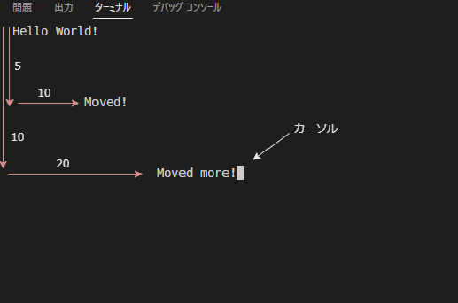

* `fresh` マクロ

`fresh` マクロは、画面を更新します。 `printw` マクロで文字を表示したときは、画面に表示されません(環境と場合による)。 `fresh` マクロを呼び出すと、画面に表示されます。

* `getch` マクロ

`getch` マクロは、キー入力を待ちます。 呼び出すと、キー入力を待ちます。キー入力があると、そのキーのキーコードが返ります。キー入力が来るまで、プログラムは止まります。マウスのクリック、スクロールもキー入力として扱われます。

### 3.2. ncurses で色をつける

先程作ったサンプルコードを書換えます。

```c
#include <ncurses.h>

int main(void)
{
	initscr();

	start_color();
	init_pair(1, COLOR_BLACK, COLOR_WHITE); // 黒文字、白背景
	init_pair(2, COLOR_WHITE, COLOR_RED);	// 白文字、赤背景
	init_pair(3, COLOR_CYAN, COLOR_BLUE);	// 水色文字、青背景

	bkgd(COLOR_PAIR(1)); // 背景色を設定

	printw("Hello World!");
	move(5, 10);

	attrset(COLOR_PAIR(2)); // 文字色を設定
	printw("Moved!");

	attrset(COLOR_PAIR(3)); // 文字色を設定
	mvprintw(10, 20, "Moved more!");

	refresh();
	getch();
	endwin();
}
```

* `start_color` 関数

`start_color` 関数は、色を使うための初期化関数です。 `start_color` 関数を呼び出さないと、色を使えません。

* `init_pair` 関数

`init_pair` 関数は、色を設定します。第1引数に色の番号を指定します。第2引数に文字色、第3引数に背景色を指定します。パレットの番号に色を設定している感じです。

上のコードでは、`黒文字、白背景` と、 `白文字、赤背景` と、 `水色文字、青背景`を設定しました。

* `bkgd` マクロ

`bkgd` マクロは、背景色を設定します。 `bkgd(COLOR_PAIR(1))` とすると、デフォルトの背景色が `init_pair` で `1` に設定した `黒文字、白背景` になります。 `COLOR_PAIR(2)` にすると、背景色が `白文字、赤背景` になります。

* `attrset` マクロ

`attrset` マクロは、文字色と背景色を設定します。 `attrset(COLOR_PAIR(2))` とすると、次以降呼び出されるPrint系の文字色が `init_pair` で `2` に設定した `白文字、赤背景` になります。 `COLOR_PAIR(3)` にすると、文字色が `水色文字、青背景` になります。

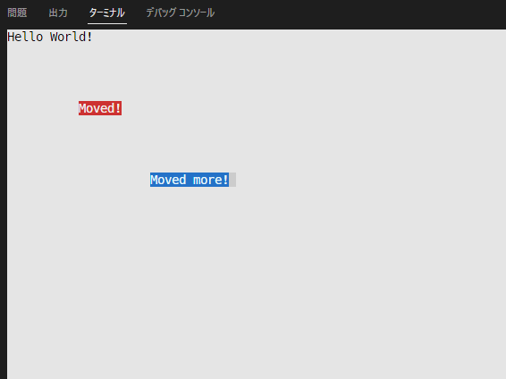

`bkgr` でデフォルトの背景色が `黒文字、白背景` になったので、背景が真っ白で、 `Hello World!` は `黒文字` で表示されました。 `Moded!` と `Moved more!` は先程指定した `2` と `3` の色になりました。

### 3.3. マウスの取得

マウスでコンソールをクリックして、クリックした場所を取得してみましょう。下記のコードは、クリックした場所に `*` を表示し、その座標も表示します。座標はコンソールの文字の座標です。 `q` キーで終了します。

```c
#include <ncurses.h>

int main(void)
{
	initscr();

	noecho();						   // 入力された文字を表示しない
	curs_set(0);					   // カーソルを非表示
	keypad(stdscr, TRUE);			   // マウスイベントの取得に必要
	mousemask(ALL_MOUSE_EVENTS, NULL); // マウスイベントを取得

	MEVENT event;
	int ch;
	int x, y;

	while ((ch = getch()) != 'q')
	{
		if (ch != KEY_MOUSE)
			continue;

		if (getmouse(&event) == OK)
		{
			x = event.x;
			y = event.y;

			mvprintw(0, 0, "x: %d, y: %d  ", x, y);
			mvprintw(y, x, "*");
		}

	}

	refresh();
	endwin();
}
```

* `noecho` 関数

`noecho` 関数は、入力された文字を表示しないようにします。 この関数の部分をコメントアウトすると、 `q` キー以外を押したとき、その文字がコンソールに出てきます。

* `curs_set` 関数

`curs_set` 関数は、カーソルを表示するかどうかを設定します。 `0` にすると、カーソルが非表示になります。

* `keypad` 関数

`keypad` 関数は、キーパッドを使うかどうかを設定します。 `TRUE` にすると、キーパッドを使えるようになります。マウスイベントを取得するために必要です。

* `mousemask` 関数

`mousemask` 関数は、マウスイベントを取得するために必要です。 `ALL_MOUSE_EVENTS` にすると、マウスの全てのイベントを取得できます。

* `getmouse` 関数

`getmouse` 関数は、マウスのイベントを取得します。 `MEVENT` 構造体にイベントの情報が格納されます。

* `MEVENT` 構造体

`MEVENT` 構造体は、マウスのイベントの情報を格納する構造体です。 `x` と `y` には、コンソールの文字の座標が格納されます。

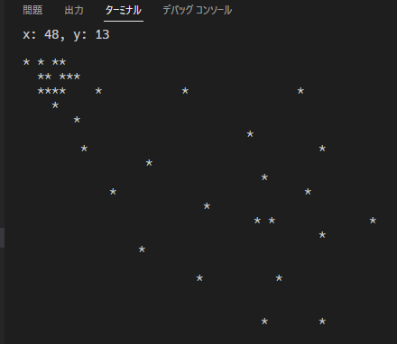


## 4. リバーシプログラム

サクッと盤面の表示に使う ncurses について触れました。ここからリバーシを作っていきます。

完成したらこんなかんじ

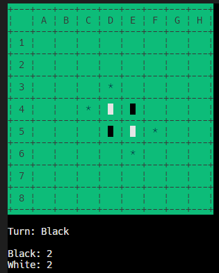

Reversi ディレクトリの src にソース・ファイル、 incude にヘッダ・ファイルがあります。これらを埋めていきます。

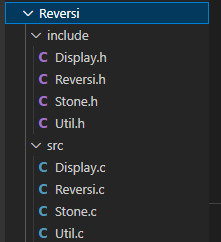

* モジュール

リバーシのプログラムを機能ごとにソースコードを分けます。 `Reversi` はメインのモジュールです。 `Display` はリバーシの盤の表示やターン、スコアをコンソールに表示させるモジュールです。 `Stone` はリバーシの石の情報を提供するモジュールです。 `Util` は Utilitiy の略で、ちょっとした機能を提供するモジュールです。

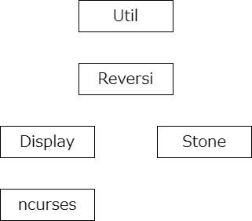

### 4.1. ビットボード

今回のリバーシでは、盤面を表すのに、 **ビットボード** と言うものを使っています。ビットボードとは整数型の変数を 2 進数で扱って、盤面の状態を表す方法です。今回は 8x8 の盤面を表すので、64bit の変数を使って、盤面の状態を表します。白黒それぞれでビットボードを用意して、盤面の状態を表します。

* 石がある場所を求める

白か黒、どちらかがある盤面は、白と黒のビットボードの積で求められます。


### 4.2. 空の盤を表示する。

`Display.h` に空の盤の文字列を定義している変数 `Blank` をすでに書いてあります。(書くのが大変なので...)

```c
#pragma once

static const char Blank[] = "\
+---+---+---+---+---+---+---+---+---+\n\
|   | A | B | C | D | E | F | G | H |\n\
+---+---+---+---+---+---+---+---+---+\n\
| 1 |   |   |   |   |   |   |   |   |\n\
+---+---+---+---+---+---+---+---+---+\n\
| 2 |   |   |   |   |   |   |   |   |\n\
+---+---+---+---+---+---+---+---+---+\n\
| 3 |   |   |   |   |   |   |   |   |\n\
+---+---+---+---+---+---+---+---+---+\n\
| 4 |   |   |   |   |   |   |   |   |\n\
+---+---+---+---+---+---+---+---+---+\n\
| 5 |   |   |   |   |   |   |   |   |\n\
+---+---+---+---+---+---+---+---+---+\n\
| 6 |   |   |   |   |   |   |   |   |\n\
+---+---+---+---+---+---+---+---+---+\n\
| 7 |   |   |   |   |   |   |   |   |\n\
+---+---+---+---+---+---+---+---+---+\n\
| 8 |   |   |   |   |   |   |   |   |\n\
+---+---+---+---+---+---+---+---+---+";
```

* プログラムの改行

プログラムを途中で改行したいときは、 `\` を行末につけることで、改行することができます。上記では盤を見やすくするために、開業して書いています。しかし、**改行コードは書いてあげないといけません**。 改行させれば、以下のような書き方もできます。

```c
int a \
= 0;
```

* 定数変数

変数を定義し、値を変更させたくないときは、定数として定義します。定数は `const` をつけることで定義できます。定数は、プログラムの中で値を変更することができません。コンパイルするときにエラーが出ます。以下の用に、絶対に値が変わってほしく無い変数は定数にしましょう。

```c
const float PI = 3.14;
const float E = 2.71;
```

* 静的変数

変数 Blank は表示するときに使うので、他のモジュールからは使わない変数です。他のモジュールから使わない変数は、 `static` をつけて静的変数として定義します。 `static` をつけることで、他のモジュールからは使えなくなります。

* #pragma once

`#pragma once` は、ヘッダファイルをインクルードするときに、一度だけインクルードするようにするためのものです。モジュールを分けてプログラムを書いたときにバグらないようにするためにヘッダファイルに書くおまじないだと思って下さい。

#### 4.2.1. Display の初期化

Display モジュールに ncurses の初期化する処理を作ります。表示する処理はすべて Display モジュールが持つので、 Reversi モジュールが ncurses を触れる必要はありません。

`Display.h` の `#pragma once` の下に `ncurses.h` をインクルードして下さい。

```c
#include <ncurses.h>
```

`Display.h` に以下のように `InitDisplay()` を宣言して下さい。

```c
void InitDisplay();
```

`Display.c` に以下のように `InitDisplay()` を定義して下さい。 `#include "Display.h"` をファイルの最初に書くのを忘れないで下さい。 `Init` とは、**Initialize** の略で、 **初期化**という意味です。他人が書いたコードや API を見てるとき、 `init` って文字があったらなんか初期化してるんだな～と思って下さい。 `Display の初期化` ってコメントは関数名の1行上に書いて下さい。(後で面白いことできます)

```c
#include "Display.h"

// Display の初期化
void InitDisplay()
{
	initscr();						   // ncursesの初期化
	noecho();						   // 入力された文字を表示しない
	curs_set(0);					   // カーソルを非表示
	keypad(stdscr, TRUE);			   // マウスイベントの取得に必要
	mousemask(ALL_MOUSE_EVENTS, NULL); // マウスイベントを取得
}
```

#### 4.2.2. Display に表示

`Display.h` に以下のように `PrintBlank()` を宣言して下さい。

```c
void PrintBlank();
```

`Display.c` に以下のように `PrintBlank()` を定義して下さい。関数のコメントも書いて下さい。  `Display.h` で `#include <ncurses.h>` をインクルードしてるので、 `Display.c` でインクルードする必要はありません。 `Blank` は `Display.h` で定義した空の盤です。

```c
// 石が置かれていない盤を表示
void PrintBlank()
{
	mvprintw(0, 0, Blank);
}
```

#### 4.2.3. Display の終了処理

`Display.h` に以下のように `DisposeDisplay()` を宣言して下さい。

```c
void DisposeDisplay();
```

`Display.c` に以下のように `DisposeDisplay()` を定義して下さい。 `Dispose` とは単語的に破棄という意味ですが、**終了処理**を意味します。他人が書いたコードや API を見てるとき、 `dispose` って文字があったらなんか終了処理してるんだな～と思って下さい。関数のコメントも書いて下さい。 

`DisposeDisplay()` では、 `q` キーが押されたら、 `ncurses` を終了します。

```c
// 終了処理
void DisposeDisplay()
{
	while (getch() != 'q');
	endwin();
}
```

フローチャート

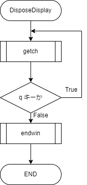

#### 4.2.4. Reversi.c から呼び出す

`Reversi.h` に `Display.h` をインクルードして下さい。ちなみに `#pragma once` はすでに書いてあります。

```c
#pragma once

#include "Display.h"
```

`Reversi.c` に `main` 関数を以下の用に定義して下さい。( `Reversi.h` に宣言する必要はあリません。)

```c
#include "Reversi.h"

int main()
{
	InitDisplay();
	PrintBlank();
	DisposeDisplay();
	return 0;
}
```

フローチャート

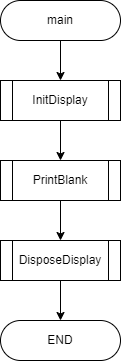

関数にマウスカーソルを合わせてみてください。すると、関数の説明が出てきます(下の画像だと `InitDisplay()` )。この説明文が先程関数を定義したときに関数の1行上に書いたコメントです。この用にすると関数の説明が見やすくて便利ですね。この機能は変数にもできます。

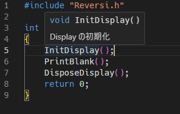

#### 4.2.5. 複数ファイルをまとめてコンパイル

`Reversi` ディレクトリに移動して下さい。

```bash
cd Reversi
```

`Reversi.c` と `Display.c` をまとめてコンパイルします。

```bash
gcc src/Reversi.c src/Display.c -I include -lncurses
```

複数のソースファイルをまとめてコンパイルするには、すべてのコードを書き込むことでコンパイルできます。今回コンパイルしたいファイルは `src` の中にある `Reversi.c` と `Display.c` なので、その2つのファイルを直接指定し下さい。また、ヘッダファイルはすべて `include` の中にあるので、 `-I` オプションでディレクトリを指定して下さい。`-lncurses` は `ncurses` ライブラリをリンクするためのオプションです。

コンパイルできたら実行してみましょう。(コンパイルできなかったら先輩を呼んで下さい。)

```bash
./a.out
```

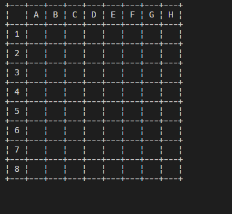

何も無い盤が表示されましたね。 `q` キーを押すと終了します。

### 4.3. 盤に色を付ける

色、ほしいですよね？

`Display.c` の `InitDisplay()` に以下のように加筆して下さい。

```c
// 初期化
void InitDisplay()
{
	initscr();						   // ncursesの初期化
	noecho();						   // 入力された文字を表示しない
	curs_set(0);					   // カーソルを非表示
	keypad(stdscr, TRUE);			   // マウスイベントの取得に必要
	mousemask(ALL_MOUSE_EVENTS, NULL); // マウスイベントを取得

	start_color();
	init_pair(1, COLOR_BLACK, COLOR_GREEN); // 盤面用
}
```

`1` 番の色に `黒文字, 緑背景` を設定しました。

`Display.c` の `PrintBlank()` に以下のように加筆して下さい。空の盤を表示する前に、色の設定を `1` 番に変更しています。

```c
// 石が置かれていない盤を表示
void PrintBlank()
{
	attrset(COLOR_PAIR(1));
	mvprintw(0, 0, Blank);
}
```

`Reversi.c` と `Display.c` をまとめてコンパイルして実行しましょう。

```bash
gcc src/Reversi.c src/Display.c -I include -lncurses
./a.out
```

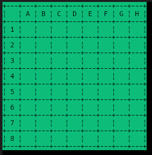

結構それっぽくないですか？

### 4.4. 石の初期配置を表示

#### 4.4.1. 石の種類

石の種類は `黒` と `白` ですが、盤には置ける場所も表示しています。


アスタリスクになっているところがおけるところです。なので、盤の石の種類は `黒` と `白` と `おける場所` の3種類です。

`Stone.h` に以下のように列挙型のSTONEを定義して下さい。 `#pragma once` はすでに書いてあります。 `enum STONE` は `typedef` で `Stone` という名前にしておきます。

```c
enum STONE
{
	Black,
	White,
	Placeable
};

typedef enum STONE Stone;
```

さらに `Stone.h` に以下のように加筆して下さい。

```c
typedef unsigned long long Board;
```

盤は符号なし 64bit の整数です。しかし、盤をいちいち `unsigned long long` と書くのは面倒なので、 `typedef` で `Board` という名前にしておきます。

#### 4.4.2. 石のビットボードを作る

`Reversi.h` に以下を加筆して下さい。 `Board` 型の変数ですが、実体は `unsigned long long` です。 `Stone.h` をインクルードして下さい。

```c
#include "Stone.h"

// 置いてある石の場所
Board BlackBoard, WhiteBoard;
```

`Reversi.c` の上の方に `InitBoard()` を宣言し、 `InitBoard()` を実装して下さい(数字に注意)。そして、 `InitBoard()` を `main()` の中で呼び出して下さい。

```c
#include "Reversi.h"

void InitBoard();	// プロトタイプ宣言

int main()
{
	InitDisplay();

	InitBoard(); // 盤の初期化

	PrintBlank();
	DisposeDisplay();
	return 0;
}

// 盤の初期化
// 石を初期配置にして表示
void InitBoard()
{
	BlackBoard = 0x0000000810000000ul;
	WhiteBoard = 0x0000001008000000ul;
}
```

`BlackBoard` と `WhiteBoard` の数字は、2進数で表すと、それぞれちょうど白と黒の盤の石の配置になっています。 `0` が置ける場所、 `1` が石が置いてある場所です。

#### 4.4.3. 盤を表示する

石の色を設定します。 `Display.c` の `InitDisplay()` に以下のように加筆して下さい。 `2` 番の色に `黒文字, 黒背景` を設定し、 `3` 番の色に `白文字, 白背景` を設定します。

```c
void InitDisplay()
{
	initscr();						   // ncursesの初期化
	noecho();						   // 入力された文字を表示しない
	curs_set(0);					   // カーソルを非表示
	keypad(stdscr, TRUE);			   // マウスイベントの取得に必要
	mousemask(ALL_MOUSE_EVENTS, NULL); // マウスイベントを取得

	start_color();
	init_pair(1, COLOR_BLACK, COLOR_GREEN); // 盤面用
	init_pair(2, COLOR_BLACK, COLOR_BLACK); // 黒石用
	init_pair(3, COLOR_WHITE, COLOR_WHITE); // 白石用
}
```

石を表示する関数を作ります。 `Display.c` の上の方に `PrintStone()` を宣言して下さい。また、 `#include "Stone.h"` をインクルードして下さい。

```c
#pragma once

#include <ncurses.h>
#include "Stone.h"

void PrintStone(int x, int y, Stone stone);
```

`PrintStone()` 関数は、盤の `(x, y)` の位置に `stone` の石を表示します。盤の座標とコンソールの文字の座標は違いがあるのに気をつけて下さい。 `(0, 0)` は盤の座標で左上ですが、コンソールの座標では `(6, 3)` です。

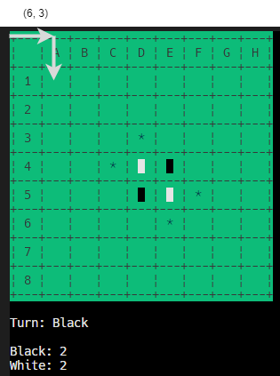

盤の座標とコンソールの座標を変換する関数を作ります。 `Util.h` に以下を加筆して下さい。ついでに、盤の座標からその座標の bit が立ったビットボードを作る関数もつくります。

```c
#pragma once

#include "Stone.h"

void XY2ConsolePos(int *x, int *y);
Board XY2Board(int x, int y);
int ConsolePos2XY(int *x, int *y);
```

`Util.c` に以下を加筆して下さい。 `#include "Util.h"` を忘れないようにして下さい。

```c
#include "Util.h"

// 盤の座標をコンソールの座標に変換
void XY2ConsolePos(int *x, int *y)
{
	*x = *x * 4 + 6;
	*y = *y * 2 + 3;
}

// 盤の座標をビットボードにする
Board XY2Board(int x, int y)
{
	// 最上部 bit だけ立てる
	Board board = 0x8000000000000000;
	board >>= x;
	board >>= y * 8;
	return board;
}

// コンソールの座標を盤の座標にする
// 失敗(範囲外だったり)すると -1 が返ってくる
int ConsolePos2XY(int *x, int *y)
{
	switch (*x)
	{
	case 5 ... 7:
		*x = 0;
		break;
	case 9 ... 11:
		*x = 1;
		break;
	case 13 ... 15:
		*x = 2;
		break;
	case 17 ... 19:
		*x = 3;
		break;
	case 21 ... 23:
		*x = 4;
		break;
	case 25 ... 27:
		*x = 5;
		break;
	case 29 ... 31:
		*x = 6;
		break;
	case 33 ... 35:
		*x = 7;
		break;
	default:
		return -1;
	}

	switch (*y)
	{
	case 3:
		*y = 0;
		break;
	case 5:
		*y = 1;
		break;
	case 7:
		*y = 2;
		break;
	case 9:
		*y = 3;
		break;
	case 11:
		*y = 4;
		break;
	case 13:
		*y = 5;
		break;
	case 15:
		*y = 6;
		break;
	case 17:
		*y = 7;
		break;
	default:
		return -1;
	}

	return 0;
}
```

swich 文の `...` は case の範囲指定です。 `5 ... 7` は `5, 6, 7` と同じです。

`PrintStone` を実装します。 `Display.c` に以下を加筆して下さい。

```c
// 盤の x, y に stone を表示
// stone が Placeable なら 置ける場所を表示
void PrintStone(int x, int y, Stone stone)
{
	XY2ConsolePos(&x, &y);

	switch (stone)
	{
	case Black:
		SET_BLACK();
		mvprintw(y, x, " ");
		break;
	case White:
		SET_WHITE();
		mvprintw(y, x, " ");
		break;
	}
}
```

`Display.h` に `Util.h` をインクルードし、 `Printoard` を宣言して下さい。

```c
#include "Util.h"
```

```c
void PrintBoard(Board board, Stone stone);
```

`Display.c` に `PrintBoard` を実装して下さい。

```c
// board を stone として表示
// stone が Placeable なら 置ける場所を表示
void PrintBoard(Board board, Stone stone)
{
	Board pos;

	for (int x = 0; x < 8; x++)
	{
		for (int y = 0; y < 8; y++)
		{
			pos = XY2Board(x, y);
			if (board & pos)
			{
				PrintStone(x, y, stone);
			}
		}
	}
}
```

2重の for 文で盤のすべての場所を調べ、石が置いてある場所に `PrintStone` を呼び出します。 `x` と `y` からあるか調べたい `Board` を `XY2Board` で作り、 `board` と `&` でビット積をとります。ビット積は、ビットが立っている場所だけが立っているビット列になります。 pos は調べたいビットだけが1つだけ立っているので、 `board & pos` が 0 でなければ、 `board` のその場所に石があることになります。その場合は、 `PrintStone` を呼び出します。

`Reversi.c` で呼び出しましょう。 `main` 関数を以下の用に書き換えて下さい。空の盤を表示してから、黒と白の盤を表示して下さい。

```c
int main()
{
	InitDisplay();

	InitBoard(); // 盤の初期化

	PrintBlank();
	PrintBoard(BlackBoard, Black);
	PrintBoard(WhiteBoard, White);

	DisposeDisplay();
	return 0;
}
```

コンパイルして実行して下さい。 `src/Stone.c` と `src/Util.c` が追加されていることに注意して下さい。

```bash
gcc src/Reversi.c src/Display.c src/Stone.c src/Util.c -I include -lncurses
./a.out
```

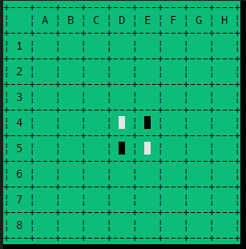

いいかんじですね

### 4.5. 置ける場所の表示

完成品では、置ける場所がアスタリスクで表示されています。


#### 4.5.1. ビットボードで置ける場所の計算

以下の場面で、黒が置ける場所を計算します。星の場所がおける場所です。

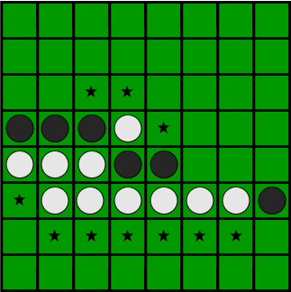

また、黒と白のビットボードは以下のとおりです。

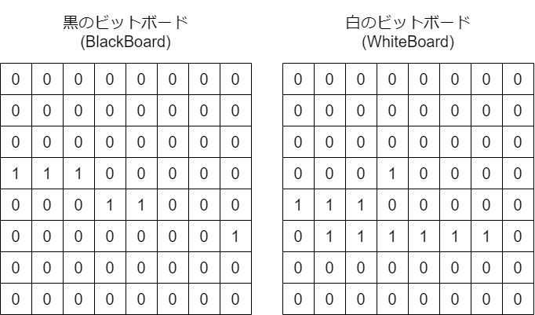

はじめに黒が左方向に置ける場所を計算します。該当する場所は 1 か所だけですね。

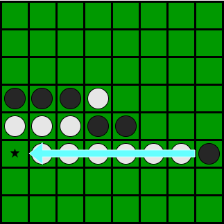

* 空いてるマスを計算する

空いてるところが 1 のビットボードを作ります。 BlackBoard と WhiteBoard のビット和を取ったものを反転すると、空いている場所が 1 になります。

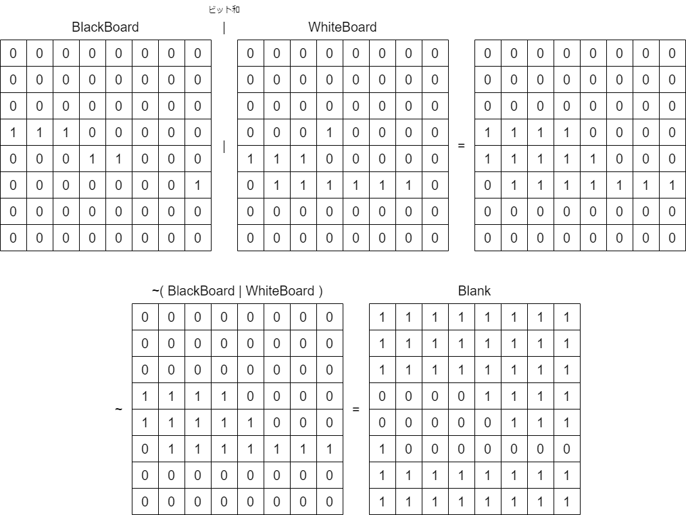

* ビットボードのシフト

黒の盤の `BlackBoard` を 左に 1 bit シフトします。以下の画像の用になります。行のうち、一番左にあるマスは、 1 bit シフトすると、1 つ上の行の一番右にあるマスになります。最上位 bit である一番左上のマスは、 1 bit シフトすると消えます。また、最下位 bit である一番右下のマスは、 1 bit シフトすると 0 が追加されます。

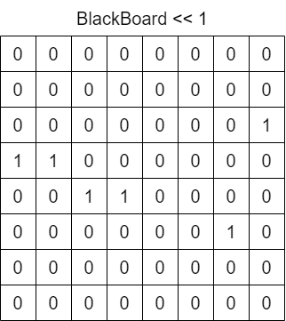

水平方向を求める際、両サイドのマスはいらないので、マスクをかけます。

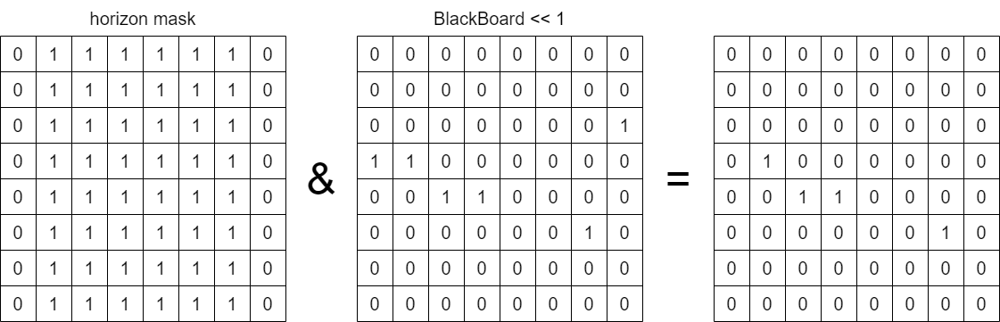

求めたビットボードを左に 1 bit シフトし、マスクをかけるのをさらに 5 回繰り返します。

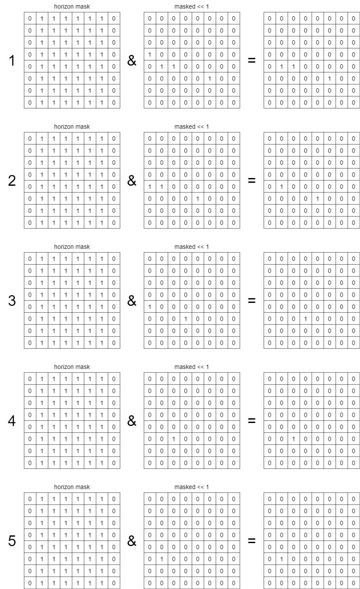

最後に、空いているマスと、左に 1 bit シフトしたもののビット積をとります。これで、左方向に置ける場所が求まりました。星がついてる場所と一致すると思います。

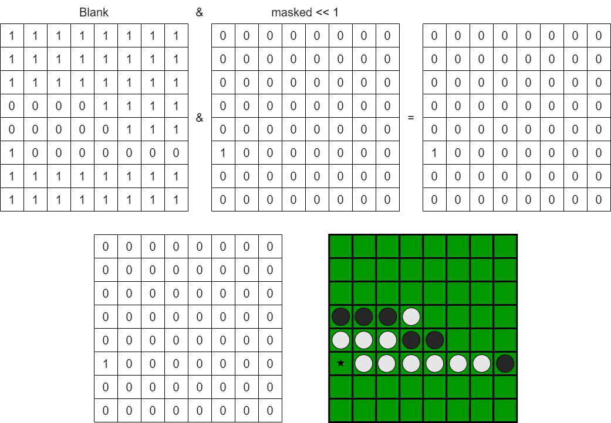

* 8 方向の置ける場所

左方向に置ける場所を求めるには、左に 1 bit シフトしました。右方向には右に 1 bit シフトします。それぞれの方向とシフトの向きと大きさは以下のとおりです。

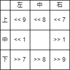

また、水平方向へシフトするときと、垂直方向へシフトするときと、斜め方向へシフトするときで、マスクをかけるビット列が異なります。斜め方向のときは全方向のマスクをかけます。

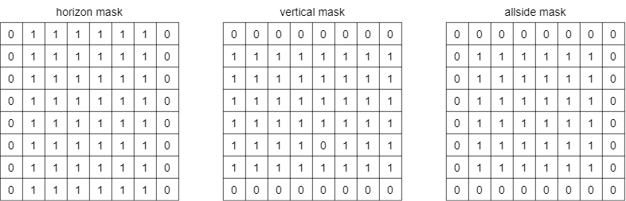

8 方向それぞれ求めたら、ビット和を取ります。これで、黒が置ける場所が求まります。

### 4.5.2. 置ける場所の表示の実装

`Reversi.h` に以下の変数を追加します。黒と白の置ける場所を表すビットボードです。

```c
// 置ける場所
Board BlackPlaceableBoard, WhitePlaceableBoard;
```

`Reversi.c` に `CaluculatePlaceableBoard` を宣言して下さい。 `opponent` に対する `checkBoard` の置ける場所を計算します。

```c
Board CaluculatePlaceableBoard(Board checkBoard, Board opponent);	// プロトタイプ宣言
```

`Reversi.c` に下記の `CaluculatePlaceableBoard` を実装して下さい。

```c
// おける場所の計算
Board CaluculatePlaceableBoard(Board checkBoard, Board opponent)
{
	// 左右のマスク
	Board horizon = opponent & 0x7e7e7e7e7e7e7e7eul;
	// 上下のマスク
	Board vertical = opponent & 0x00FFFFFFFFFFFF00ul;
	// 全辺のマスク
	Board allSide = opponent & 0x007e7e7e7e7e7e00ul;
	// 空いてる場所
	Board blank = ~(checkBoard | opponent);

	Board tmp;
	Board result;

	// 左
	tmp = horizon & (checkBoard << 1);
	tmp |= horizon & (tmp << 1);
	tmp |= horizon & (tmp << 1);
	tmp |= horizon & (tmp << 1);
	tmp |= horizon & (tmp << 1);
	tmp |= horizon & (tmp << 1);
	result = blank & (tmp << 1);

	// 右
	tmp = horizon & (checkBoard >> 1);
	tmp |= horizon & (tmp >> 1);
	tmp |= horizon & (tmp >> 1);
	tmp |= horizon & (tmp >> 1);
	tmp |= horizon & (tmp >> 1);
	tmp |= horizon & (tmp >> 1);
	result |= blank & (tmp >> 1);

	// 上
	tmp = vertical & (checkBoard << 8);
	tmp |= vertical & (tmp << 8);
	tmp |= vertical & (tmp << 8);
	tmp |= vertical & (tmp << 8);
	tmp |= vertical & (tmp << 8);
	tmp |= vertical & (tmp << 8);
	result |= blank & (tmp << 8);

	// 下
	tmp = vertical & (checkBoard >> 8);
	tmp |= vertical & (tmp >> 8);
	tmp |= vertical & (tmp >> 8);
	tmp |= vertical & (tmp >> 8);
	tmp |= vertical & (tmp >> 8);
	tmp |= vertical & (tmp >> 8);
	result |= blank & (tmp >> 8);

	// 右斜め上
	tmp = allSide & (checkBoard << 7);
	tmp |= allSide & (tmp << 7);
	tmp |= allSide & (tmp << 7);
	tmp |= allSide & (tmp << 7);
	tmp |= allSide & (tmp << 7);
	tmp |= allSide & (tmp << 7);
	result |= blank & (tmp << 7);

	// 左斜め上
	tmp = allSide & (checkBoard << 9);
	tmp |= allSide & (tmp << 9);
	tmp |= allSide & (tmp << 9);
	tmp |= allSide & (tmp << 9);
	tmp |= allSide & (tmp << 9);
	tmp |= allSide & (tmp << 9);
	result |= blank & (tmp << 9);

	// 右斜め下
	tmp = allSide & (checkBoard >> 9);
	tmp |= allSide & (tmp >> 9);
	tmp |= allSide & (tmp >> 9);
	tmp |= allSide & (tmp >> 9);
	tmp |= allSide & (tmp >> 9);
	tmp |= allSide & (tmp >> 9);
	result |= blank & (tmp >> 9);

	// 左斜め下
	tmp = allSide & (checkBoard >> 7);
	tmp |= allSide & (tmp >> 7);
	tmp |= allSide & (tmp >> 7);
	tmp |= allSide & (tmp >> 7);
	tmp |= allSide & (tmp >> 7);
	tmp |= allSide & (tmp >> 7);
	result |= blank & (tmp >> 7);

	return result;
}
```

`Reversi.c` に `UpdatePlaceable` を宣言して下さい。 `BlackPlaceableBoard` `WhitePlaceableBoard` を更新する関数です。

```c
void UpdatePlaceable();	// プロトタイプ宣言
```

`Reversi.c` に `UpdatePlaceable` を実装して下さい。

```C
// 置ける場所の更新
void UpdatePlaceable()
{
	BlackPlaceableBoard = CaluculatePlaceableBoard(BlackBoard, WhiteBoard);
	WhitePlaceableBoard = CaluculatePlaceableBoard(WhiteBoard, BlackBoard);
}
```

`Reversi.c` の main関数で `UpdatePlaceable` を呼び出して下さい。そして、黒が置ける場所を表示させてください。

```C
int main()
{
	InitDisplay();

	InitBoard();	   // 盤の初期化
	UpdatePlaceable(); // 置ける場所の更新

	PrintBlank();
	PrintBoard(BlackBoard, Black);
	PrintBoard(WhiteBoard, White);
	PrintBoard(BlackPlaceableBoard, Placeable); // 置ける場所の表示

	DisposeDisplay();
	return 0;
}
```

`Display.c` の `InitDisplay` で、置ける場所の色を設定します。 `4` 番の色を `COLOR_CYAN` と `COLOR_GREEN` で設定して下さい。

```c
void InitDisplay()
{
	initscr();						   // ncursesの初期化
	noecho();						   // 入力された文字を表示しない
	curs_set(0);					   // カーソルを非表示
	keypad(stdscr, TRUE);			   // マウスイベントの取得に必要
	mousemask(ALL_MOUSE_EVENTS, NULL); // マウスイベントを取得

	start_color();
	init_pair(1, COLOR_BLACK, COLOR_GREEN); // 盤面用
	init_pair(2, COLOR_BLACK, COLOR_BLACK); // 黒石用
	init_pair(3, COLOR_WHITE, COLOR_WHITE); // 白石用
	init_pair(4, COLOR_CYAN, COLOR_GREEN);	// 置ける場所用
}
```

`Display.c` の `PrintStone` で、置ける場所の処理を追加します。 switch 文に `Placeable` の case を追加して下さい。

```c
// 盤の x, y に stone を表示
// stone が Placeable なら 置ける場所を表示
void PrintStone(int x, int y, Stone stone)
{
	XY2ConsolePos(&x, &y);

	switch (stone)
	{
	case Black:
		attrset(COLOR_PAIR(2));
		mvprintw(y, x, " ");
		break;
	case White:
		attrset(COLOR_PAIR(3));
		mvprintw(y, x, " ");
		break;
	case Placeable:
		attrset(COLOR_PAIR(4));
		mvprintw(y, x, "*");
		break;
	}
}
```

コンパイルして実行して下さい。

```bash
gcc src/Reversi.c src/Display.c src/Stone.c src/Util.c -I include -lncurses
./a.out
```

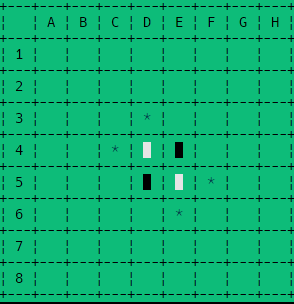

黒が置ける場所が表示されました！

### 4.6. スコア(石の数)の表示

スコアの求め方は簡単です。ビットボードの立っているビットの数を数えれば良いです。

#### 4.6.1. ビットボードの立っているビットの数を数える

`__builtin_popcountll` というマクロを使うと、 `unsinged long long` の立っているビットの数を数えることができます。(分割統治法つかったポップカウントってやつで数えてます。説明ちょっとめんどいので省きます。)

`Reversi.h` にスコアを格納する変数を追加して下さい。

```c
// スコア
int BlackScore, WhiteScore;
```

`Reversi.c` に `UpdateScore` を追加して下さい。スコアを更新する関数です。

```c
void UpdateScore();	// プロトタイプ宣言
```

`Reversi.c` に `UpdateScore` を実装して下さい。それぞれの色のボードの立っているビットを数えて、スコアを更新します。

```c
// スコアの更新
void UpdateScore()
{
	BlackScore = __builtin_popcountll(BlackBoard);
	WhiteScore = __builtin_popcountll(WhiteBoard);
}
```

#### 4.6.2. スコアを表示する

`Display.c` の `InitDisplay` で、スコアなどの情報表示用の色を設定します。 `5` 番の色を `COLOR_WHITE`, ` COLOR_BLACK` で設定して下さい。

```c
void InitDisplay()
{
	initscr();						   // ncursesの初期化
	noecho();						   // 入力された文字を表示しない
	curs_set(0);					   // カーソルを非表示
	keypad(stdscr, TRUE);			   // マウスイベントの取得に必要
	mousemask(ALL_MOUSE_EVENTS, NULL); // マウスイベントを取得

	start_color();
	init_pair(1, COLOR_BLACK, COLOR_GREEN); // 盤面用
	init_pair(2, COLOR_BLACK, COLOR_BLACK); // 黒石用
	init_pair(3, COLOR_WHITE, COLOR_WHITE); // 白石用
	init_pair(4, COLOR_CYAN, COLOR_GREEN);	// 置ける場所用
	init_pair(5, COLOR_WHITE, COLOR_BLACK); // 情報表示用
}
```

`Display.h` に `PrintScore` を追加して下さい。

```c
void PrintScore(int black, int white);
```

`Display.c` に `PrintScore` を追加して下さい。

```c
// スコアを表示
void PrintScore(int black, int white)
{
	attrset(COLOR_PAIR(5));
	mvprintw(22, 0, "Black: %d", black);
	mvprintw(23, 0, "White: %d", white);
}
```

`Reversi.c` で `UpdateScore()` でスコアを更新し、 `PrintScore(BlackScore, WhiteScore)` でスコアを表示します。

```c
int main()
{
	InitDisplay();

	InitBoard();	   // 盤の初期化
	UpdatePlaceable(); // 置ける場所の更新

	PrintBlank();
	PrintBoard(BlackBoard, Black);
	PrintBoard(WhiteBoard, White);
	PrintBoard(BlackPlaceableBoard, Placeable); // 置ける場所の表示

	UpdateScore();						// スコアの更新
	PrintScore(BlackScore, WhiteScore); // スコアの表示

	DisposeDisplay();
	return 0;
}
```

コンパイルして実行して下さい。

```bash
gcc src/Reversi.c src/Display.c src/Stone.c src/Util.c -I include -lncurses
./a.out
```

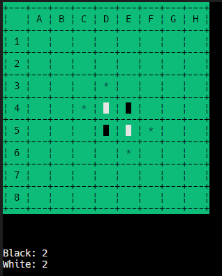

白と黒の石の数が表示されました！

### 4.7. 石を置いてひっくり返す

石はマウスでクリックして置きます。下記の 1 マスの真ん中にスペース文字が 3 つあります。この 3 文字をマウスの当たり判定にします。

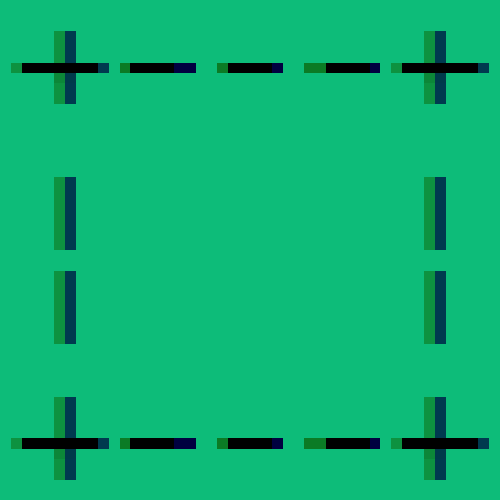

はじめに、置ける場所かを判定し、置ける場合、置く場所 8 方向にヒックリ返す石を調べます。

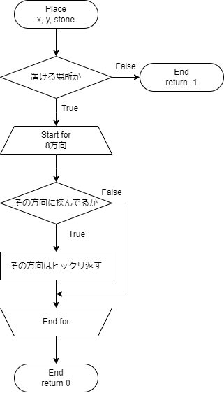

#### 4.7.1. マウスがクリックした盤の座標を取得

`Display.h` に `GetMousePos` を追加して下さい。マウスの座標を取得する関数です。 x と y の2つの変数を同時に返せないので、ポインタを使って値を取得します。

```c
void GetMousePos(int *x, int *y);
```

`Display.c` に `GetMousePos` を追加して下さい。

```c
// マウスがクリックしたコンソールの座標を取得
// 盤の石を置ける場所をクリックするまで繰り返す
void GetMousePos(int *x, int *y)
{
	MEVENT event;
	int ch;

	do
	{
		ch = getch();

		// マウスのクリックか判定 (キーボードの可能性がある)
		if (ch != KEY_MOUSE)
		{
			continue;
		}

		// マウスのイベントを取得
		if (getmouse(&event) != OK)
		{
			continue;
		}

		// マウスのイベントからコンソールのどこをクリックしたかを取得
		*x = event.x;
		*y = event.y;

		// 盤の石を置ける場所をクリックしたか判定
	} while (ConsolePos2XY(x, y));
}
```

`getch()` でキー入力を取得します。 `KEY_MOUSE` であれば、マウスのイベントを取得します。 `getmouse` でマウスのイベントを取得します。 `event.x` と `event.y` にマウスのイベントの座標が格納されています。 `ConsolePos2XY` でコンソールの座標を盤の座標に変換します。 `ConsolePos2XY` は `Display.c` に実装されています。 `ConsolePos2XY` で正しくマスの中をクリックされたら `0` が帰ってきます。正しく無い場所をクリックされたら `-1` が帰ってきます。正しくマスの真ん中がクリックされ、 `0` が帰ってくるまで繰り返します。

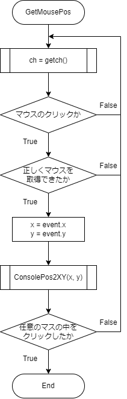

#### 4.7.2. 石が置けるか判定

`Reversi.c` に `IsPlaceable` を追加して下さい。引数に渡された座標に指定された石が置けるか判定する関数です。

```c
int IsPlaceable(int x, int y, Stone stone);
```

`Reversi.c` に `IsPlaceable` を追加して下さい。盤の座標をビットボードに変換して、そのビットボードと指定された石に応じて、 `BlackPlaceableBoard` もしくは `WhitePlaceableBoard` とビット積を取り、それが `0` でないか判定します。石を置ける場合、 ビット積が `0` で無いため、 `1` が返ります。石を置けない場合、ビット積が `0` なので、 `0` が返ります。

```c
// 置けるかどうか判定
int IsPlaceable(int x, int y, Stone stone)
{
	// 盤をビットボードに変換
	Board pos = XY2Board(x, y);

	switch (stone)
	{
	case Black:
		return (BlackPlaceableBoard & pos) ? 1 : 0;
	case White:
		return (WhitePlaceableBoard & pos) ? 1 : 0;
	}
}
```

#### 4.7.3. ひっくり返す石を調べる

例として、以下の状態で黒い石を星のマークのとこに置くときのヒックリ返す石を調べます。

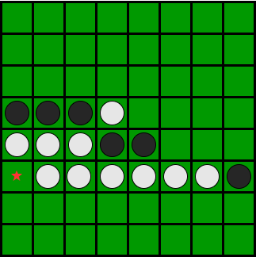

はじめに右方向について考えます。置く場所を右に 1 ビットシフトして、白い石のビットボードと積を取ったら、 `0` でないため、置く場所の右隣は白い石があることがわかります。シフトするとき、次の行に行ってしまわないようにします。そして、この場所を `tmp` に一旦記憶しておきます。これを `0` になるまで行います。


星が右まで来たら、白い石のビットボードとのビット積は `0` になります。 `0` になったら `tmp` には追加しません。

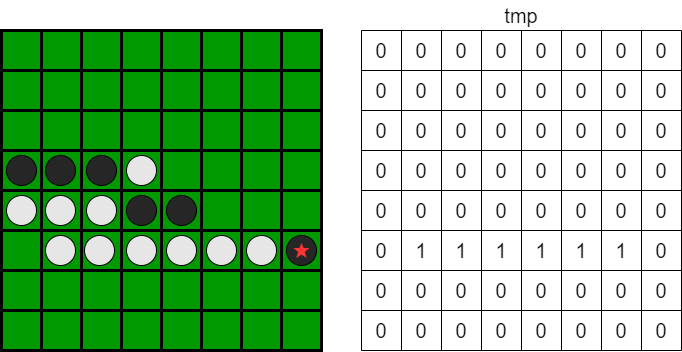

次に星のビットボードと自分の色(黒色)とのビット積を取ります。これが `0` でなければ、挟んでる判定できます。上の画像では挟んでる判定できますね。挟んでる場合、 `tmp` をひっくり返せる石として記憶します。

これを 8 方向に対して行います。すると、以下のようにひっくり返せる石がわかります。

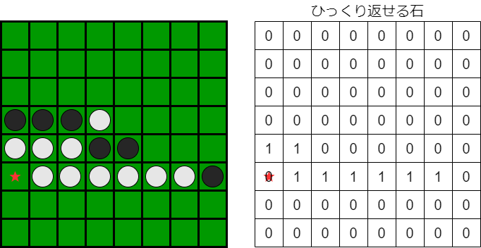

最後に自分の色(黒色)のビットボードをひっくり返すビットボードと置く場所のビットボードのビット和と排他的論理和を取ります。相手(白色)は、相手のビットボードと、ひっくり返すビットボードの排他的論理和を取ります。これで、石をひっくり返すことができます。

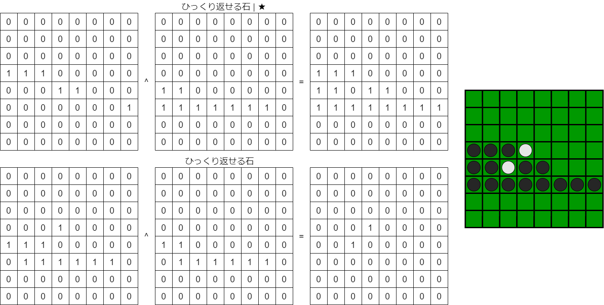

#### 4.7.4. ひっくり返す処理

`Stone.h` に以下の列挙体 `DIRECTION` と `typedef` を追加して下さい。

```c
enum DIRECTION
{
	Up,
	UpRight,
	Right,
	DownRight,
	Down,
	DownLeft,
	Left,
	UpLeft
};

typedef enum DIRECTION Direction;
```

`Reversi.c` に `BoardShift` を追加して下さい。引数に渡された盤を指定された方向にシフトします。

```c
Board BoardShift(Board board, Direction direction);	// プロトタイプ宣言
```

`Reversi.c` に `BoardShift` を追加して下さい。

```c
// borad 全体を指定した方向にずらす
Board BoardShift(Board board, Direction direction)
{
	switch (direction)
	{
	case Up:
		return (board << 8) & 0xffffffffffffff00;
	case UpRight:
		return (board << 7) & 0x7f7f7f7f7f7f7f00;
	case Right:
		return (board >> 1) & 0x7f7f7f7f7f7f7f7f;
	case DownRight:
		return (board >> 9) & 0x007f7f7f7f7f7f7f;
	case Down:
		return (board >> 8) & 0x00ffffffffffffff;
	case DownLeft:
		return (board >> 7) & 0x00fefefefefefefe;
	case Left:
		return (board << 1) & 0xfefefefefefefefe;
	case UpLeft:
		return (board << 9) & 0xfefefefefefefe00;
	}
}
```

`Reversi.c` に `Place` を追加して下さい。引数の座標に引数の石を置きます。

```c
int Place(int x, int y, Stone stone);	// プロトタイプ宣言
```

`Reversi.c` に `Place` を追加して下さい。

```c
// 石を置く
int Place(int x, int y, Stone stone)
{
	if (!IsPlaceable(x, y, stone))
		return -1;

	Board placePos = XY2Board(x, y);							  // 置く場所
	Board *opponent = stone == Black ? &WhiteBoard : &BlackBoard; // 相手の石
	Board *me = stone == Black ? &BlackBoard : &WhiteBoard;		  // 自分の石
	Board reverse = 0ull;										  // ひっくり返す石

	// 8方向
	for (int direction = 0; direction < 8; direction++)
	{
		Board tmp = 0ull;
		Board mask = BoardShift(placePos, (Direction)direction);

		// 相手の石があったらtmpに追加
		while (mask != 0ull && ((mask & *opponent) != 0ull))
		{
			tmp |= mask;
			mask = BoardShift(mask, (Direction)direction);
		}

		// 挟んでたらreverseに追加
		if ((mask & *me) != 0ull)
			reverse |= tmp;
	}

	// ひっくり返す
	*me ^= placePos | reverse;
	*opponent ^= reverse;

	return 0;
}
```

#### 4.7.5. ひっくり返す

`Reversi.c` の `main` 関数を以下のように書換えて下さい。マウスのクリックを取得し、それが置ける場所なら、その場所に石を置きます。

```c
int main()
{
	int x, y;
	InitDisplay();

	InitBoard();	   // 盤の初期化
	UpdatePlaceable(); // 置ける場所の更新

	PrintBlank();
	PrintBoard(BlackBoard, Black);
	PrintBoard(WhiteBoard, White);
	PrintBoard(BlackPlaceableBoard, Placeable); // 置ける場所の表示

	UpdateScore();						// スコアの更新
	PrintScore(BlackScore, WhiteScore); // スコアの表示

	do
	{
		GetMousePos(&x, &y);
	} while (Place(x, y, Black) != 0);	// 置けるまでループ

	PrintBlank();
	PrintBoard(BlackBoard, Black);
	PrintBoard(WhiteBoard, White);

	DisposeDisplay();
	return 0;
}
```

コンパイルして実行して下さい。

```bash
gcc src/Reversi.c src/Display.c src/Stone.c src/Util.c -I include -lncurses
./a.out
```

置ける場所をクリックすると、以下のように石がひっくり返ります。置けない場所をクリックすると、何も起こりません。

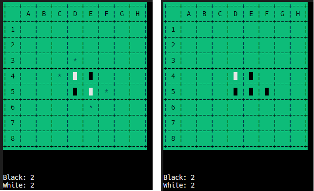

### 4.8. ターンとループと終了処理

リバーシはターン制のゲームです。ゲームを `While` 文でループさせ、黒白お互い置けなくなったら終了処理を行います。

#### 4.8.1. ターン

`Reversi.h` に以下のように `Turn` を追加して下さい。

```c
// ターン
Stone Turn = Black;
```

`Reversi.c` に `UpdateTurn` を追加して下さい。ターンを更新する関数です。引数のターンに対し、パス判定をし、次のターンを返します。ターンを更新する際、 相手の `PlaceableBoard` の立っているびとの数を数えて、相手が置けるかどうかを判定し、置けない場合はパスとします。

```c
Stone UpdateTurn(Stone stone);	// プロトタイプ宣言
```

`Reversi.c` に `UpdateTurn` を追加して下さい。

```c
// ターンの更新
// パス判定もする
Stone UpdateTurn(Stone stone)
{
	if (stone == Black && __builtin_popcountll(WhitePlaceableBoard) > 0)
		return White;
	else if (stone == White && __builtin_popcountll(BlackPlaceableBoard) > 0)
		return Black;
	else
		return stone; // パス
}
```

`Display.h` に `PrintTurn` を追加して下さい。引数のターンを表示します。

```c
void PrintTurn(Stone stone);
```

`Displaay.c` に `PrintTurn` を追加して下さい。色は情報表示用の `5` 番の色を使います。

```c
// ターンの情報を表示
void PrintTurn(Stone stone)
{
	attrset(COLOR_PAIR(5));
	switch (stone)
	{
	case Black:
		mvprintw(20, 0, "Turn: Black");
		break;
	case White:
		mvprintw(20, 0, "Turn: White");
		break;
	}
}
```

#### 4.8.2. ゲームの終了判定

`Reversi.c` に以下のように `IsGame` を追加して下さい。白黒お互いの `PlaceableBoard` の立っているビットの数を数えて、どっちも `0` かどうかで、ゲームが終了したかどうかを判定します。ゲームが終了した場合は `0` を返します。

```c
int IsGame();	// プロトタイプ宣言
```

`Reversi.c` に `IsGame` を追加して下さい。

```c
// ゲームの終了判定
int IsGame()
{
	if (__builtin_popcountll(WhitePlaceableBoard) == 0 && __builtin_popcountll(BlackPlaceableBoard) == 0)
		return 0;
	return 1;
}
```

`Reversi.c` の `InitBoard` を以下の様に書き換えて下さい。処理の順番が間違ってると、正しく動作しなかったりします。(例えば置く場所を表示してから、置く場所を更新すると変な風になる)

```c
// 盤の初期化
// 石を初期配置にして表示
void InitBoard()
{
	BlackBoard = 0x0000000810000000;
	WhiteBoard = 0x0000001008000000;

	UpdatePlaceable();
	UpdateScore();

	PrintBlank();
	PrintBoard(BlackBoard, Black);
	PrintBoard(WhiteBoard, White);
	PrintBoard(BlackPlaceableBoard, Placeable); // はじめは黒がおける場所を表示

	PrintTurn(Turn);
	PrintScore(BlackScore, WhiteScore);
}
```

`Reversi.c` の `main` 関数を以下のように書換えて下さい。処理の順番が間違ってると、正しく動作しなかったりします。(例えば置く場所を表示してから、置く場所を更新すると変な風になる)

```c
int main()
{
	int x, y;
	InitDisplay();

	InitBoard(); // 盤の初期化

	while (IsGame())
	{
		do
		{
			GetMousePos(&x, &y);
		} while (Place(x, y, Turn) != 0); // 置けるまでループ

		UpdatePlaceable();		 // 置ける場所の更新
		Turn = UpdateTurn(Turn); // ターンの更新
		PrintTurn(Turn);		 // ターンの表示

		PrintBlank();
		PrintBoard(BlackBoard, Black);
		PrintBoard(WhiteBoard, White);
		PrintBoard(Turn == Black ? BlackPlaceableBoard : WhitePlaceableBoard, Placeable); // 置ける場所の表示

		UpdateScore();						// スコアの更新
		PrintScore(BlackScore, WhiteScore); // スコアの表示
	}

	DisposeDisplay();
	return 0;
}
```

#### 4.8.3. 実行

コンパイルして実行して下さい。

```bash
gcc src/Reversi.c src/Display.c src/Stone.c src/Util.c -I include -lncurses
./a.out
```

白黒交互に置けてますね。

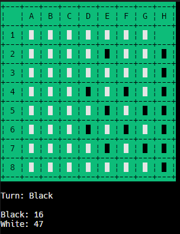

#### 4.9. 結果の表示

`Display.h` に `PrintResult` を追加して下さい。

```c
void PrintResult(int black, int white);
```

`Display.c` に `PrintResult` を追加して下さい。`Black` と `White` の数を比較して、勝敗を表示します。文字列にスペースが入っていることに注意して下さい。結果はターンの部分を上書きするように表示します。そのため、ターンの余計な文字が入らないようにするため、スペースを入れています。

```c
// 結果の表示
void PrintResult(int black, int white)
{
	attrset(COLOR_PAIR(5));
	if (black > white)
		mvprintw(20, 0, "Black Win! ");
	else if (black < white)
		mvprintw(20, 0, "White Win! ");
	else
		mvprintw(20, 0, "Draw!      ");

	mvprintw(25, 0, "Push Q Key...");
}
```

`Reversi.c` の `main` 関数を以下のように書換えて下さい。ゲームが終了し、ループ文を抜けたら、結果を表示するようにします。

```c
int main()
{
	int x, y;
	InitDisplay();
	InitBoard(); // 盤の初期化

	while (IsGame())
	{
		do
		{
			GetMousePos(&x, &y);
		} while (Place(x, y, Turn) != 0);

		UpdatePlaceable(); // 置ける場所の更新
		UpdateScore();	   // スコアの更新
		Turn = UpdateTurn(Turn);

		PrintTurn(Turn);
		PrintScore(BlackScore, WhiteScore);

		PrintBlank();
		PrintBoard(BlackBoard, Black);
		PrintBoard(WhiteBoard, White);
		PrintBoard(Turn == Black ? BlackPlaceableBoard : WhitePlaceableBoard, Placeable); // 置ける場所の表示
	}

	PrintResult(BlackScore, WhiteScore);	// 結果の表示

	DisposeDisplay();

	return 0;
}
```

コンパイルして実行して下さい。

```bash
gcc src/Reversi.c src/Display.c src/Stone.c src/Util.c -I include -lncurses
./a.out
```

勝敗が表示されました！

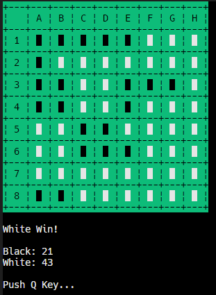

#### 4.10. 完成

これで完成です。お疲れ様でした。

コンパイルするときに `-o` オプションをつけると、実行ファイルの名前を指定できます。

```bash
gcc src/Reversi.c src/Display.c src/Stone.c src/Util.c -I include -lncurses -o Reversi
./Reversi
```
