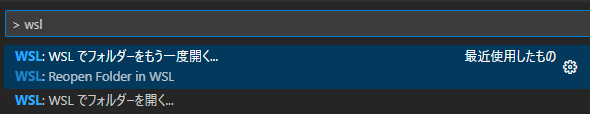
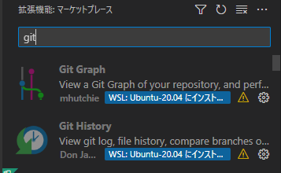
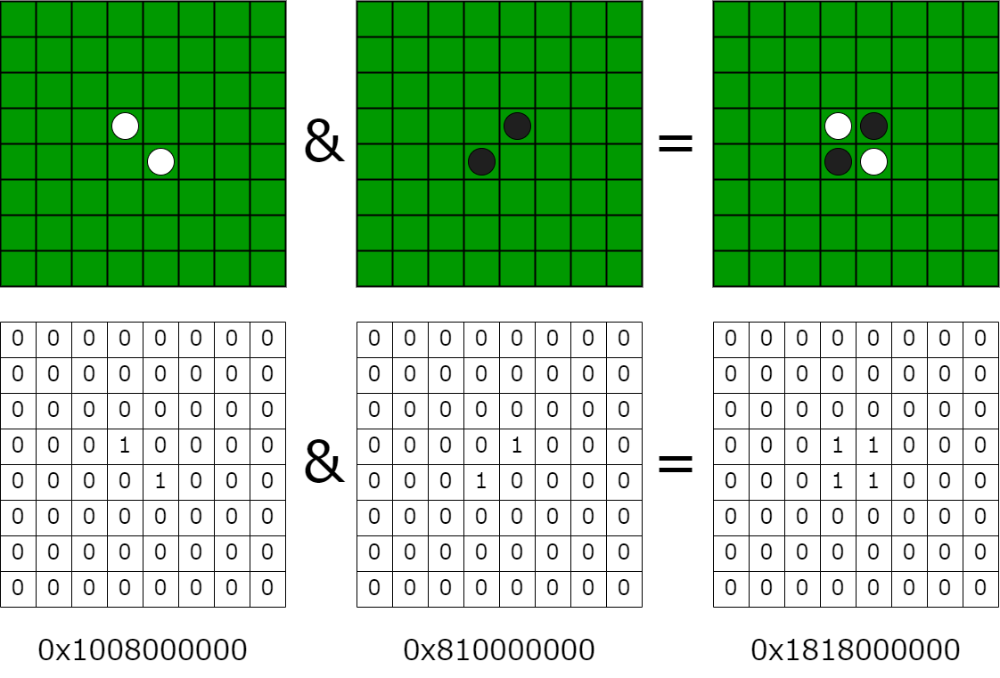
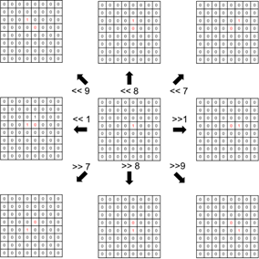

# MCC Git-C 言語講座 2

今回は Git を使って C言語 でリバーシプログラムを作ります。GIt が長くなったのでリバーシだけこっちにしました。

## リポジトリのクローン

まずこのリポジトリをクローンしましょう。

## WSL で開く(Mac の人はやらなくていいです)

Ctrl + P (Mac はたぶん Command + P) でコマンドパレットを開きます。

`> wsl` と打って出てきた `WSL でフォルダーをもう一度開く...` を選択してください。



WSL でウィンドウを開いたら VS Code の拡張機能の Git Graoh と Git History を WSL 用に入れてください。入れ直さないといけないみたいです。



最初から WSL でやれよ！とか言わないでください。 Windows でも Git の環境作ったほうが将来的に便利ですよ！！！

* メアドと名前設定

ここでも Github のダミーメアドとユーザーネームを使います。WSL でもメアドと名前のコマンドは同じです。

```
git config --global user.email メールアドレス
```
```
git config --global user.name ユーザー名
```

## リバーシプログラムの概要 (ビットボード)

今回のリバーシでは、盤面を表すのに、**ビットボード**と言うものを使っています。ビットボードとは整数型の変数を 2 進数で使って、盤面の状態を表す方法です。今回は 8x8 の盤面を表すので、64bit の変数を使って、盤面の状態を表します。白黒それぞれでビットボードを用意して、盤面の状態を表します。

* 石がある場所を求める

白か黒、どちらかがある盤面は、白と黒のビットボードの積で求められます。



* 盤面のシフト





